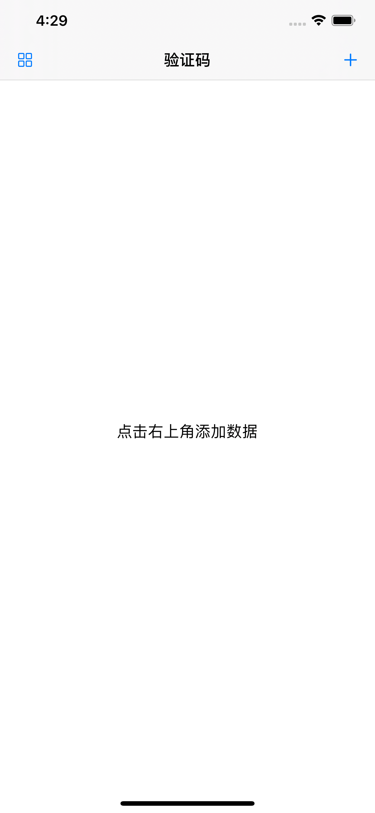
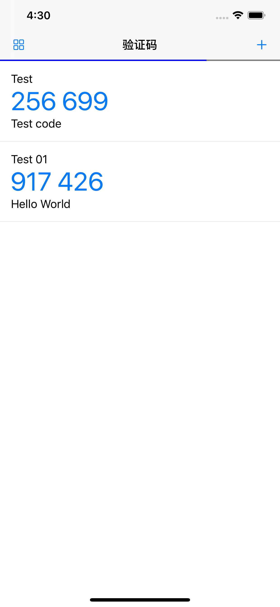
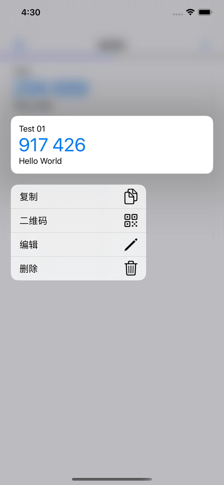
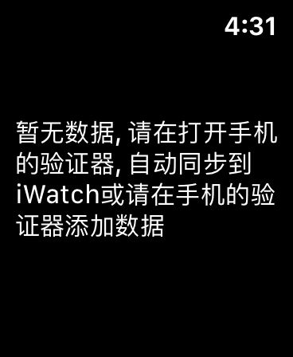
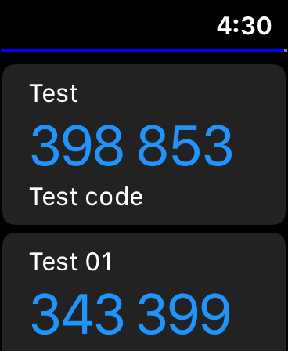

# 验证器(Authenticator)
> `GoogleAuthenticator` TOTP部分实现的验证器(没有实现HOTP)
> 
> 已上架AppStore, 可直接下载体验: <itms-apps://itunes.apple.com/app/id1509275023>

由于`GoogleAuthenticator`没有导出功能, 而且在watch上也没有查看功能, 干脆自己实现一个

纯Swift5.2实现, 操作体验良好, 界面极简

SwiftUI改写了一遍, 放弃使用第三方数据库

另外增加相册二维码导入、二维码导出、watchOS同步查看

## 功能

- [x] 相册二维码导入
- [x] 二维码导出
- [x] watchOS同步查看
- [x] 黑夜/白天模式
- [ ] 面容/指纹验证设置

## 需要

- iOS 13.0+
- watchOS 6.0+
- Xcode 11.4 beta2+

## 安装

1. clone或下载项目
2. 安装项目依赖`pod install --no-repo-update` 或 `pod install`
3. CMD + R

## 截图
#### iOS
首页-空数据

首页-有数据

首页-长按行

导出数据

#### watchOS

首页-空数据

首页-有数据

## 鸣谢
- [IQKeyboardManager](https://github.com/hackiftekhar/IQKeyboardManager)
- [MBProgressHUD](https://github.com/jdg/MBProgressHUD)
- [swiftScan](https://github.com/MxABC/swiftScan)

## 相关文章
- [GoogleAuthenticator的一次性密码生成算法](http://blog.skytoup.com/index.php/archives/43/)

## 开源协议
This code is distributed under the terms and conditions of the MIT license.
